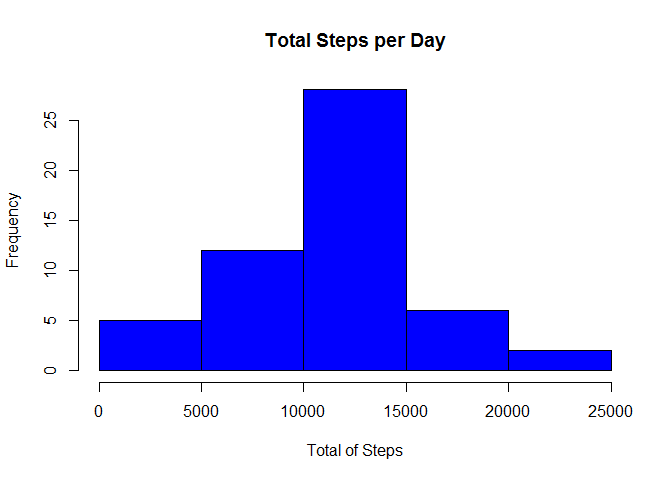
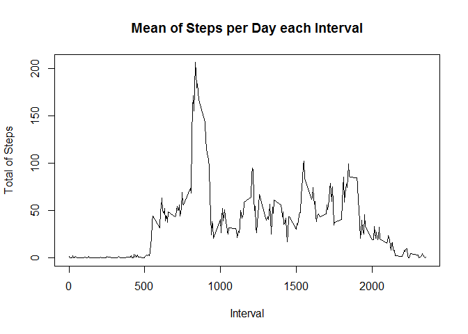
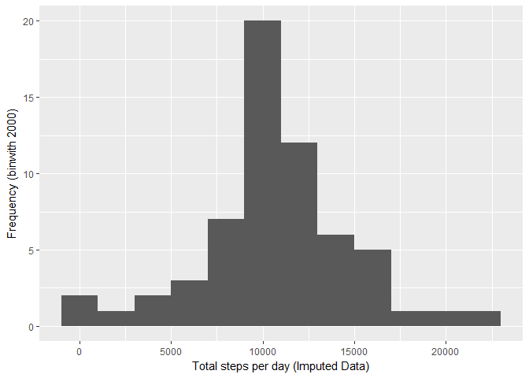

# Reproducible Research: Peer Assessment 1

## Data

The data for this assignment can be downloaded from the course web
site:

* Dataset: [Activity monitoring data](https://d396qusza40orc.cloudfront.net/repdata%2Fdata%2Factivity.zip) [52K]

The variables included in this dataset are:

* **steps**: Number of steps taking in a 5-minute interval (missing
    values are coded as `NA`)

* **date**: The date on which the measurement was taken in YYYY-MM-DD
    format

* **interval**: Identifier for the 5-minute interval in which
    measurement was taken


The dataset is stored in a comma-separated-value (CSV) file and there
are a total of 17,568 observations in this
dataset.


## Loading and preprocessing the data

Download, unzip and load data into data frame `data`. 

Please download the data from [Activity monitoring data](https://d396qusza40orc.cloudfront.net/repdata%2Fdata%2Factivity.zip) and unzip it in the current working directory in order to reproduce this analysis.


```r
data <- read.csv("activity.csv")
```


## What is mean total number of steps taken per day?

Sum steps by day, create Histogram, and calculate mean and median. Only dates were steps weren't NA were taken. Only intervals were steps weren't Na were taken.


```r
library(dplyr)
```

```
## Warning: package 'dplyr' was built under R version 3.3.3
```

```
## 
## Attaching package: 'dplyr'
```

```
## The following objects are masked from 'package:stats':
## 
##     filter, lag
```

```
## The following objects are masked from 'package:base':
## 
##     intersect, setdiff, setequal, union
```

```r
steps_day <- data %>% filter(!is.na(steps)) %>% group_by(date) %>% summarize(steps = sum(steps))
```

```
## Warning: package 'bindrcpp' was built under R version 3.3.3
```

```r
hist(steps_day$steps, main = paste("Total Steps per Day"), col="blue", xlab="Total of Steps")
```

<!-- -->

```r
mean_steps <- mean(steps_day$steps)
mean_steps
```

```
## [1] 10766.19
```

```r
median_steps <- median(steps_day$steps)
median_steps
```

```
## [1] 10765
```


## What is the average daily activity pattern?

* Calculate average steps for each interval for all days. 
* Plot the Average Number Steps per Day by Interval. 
* Find interval with most average steps. 


```r
library(dplyr)

# Calculate average steps for each interval for all days.
steps_interval <- data %>% filter(!is.na(steps)) %>% group_by(interval) %>% summarize(steps = mean(steps))

# Plot the Average Number Steps per Day by Interval.
plot(steps_interval$interval,steps_interval$steps, type="l", xlab="Interval", ylab="Total of Steps",main="Mean of Steps per Day each Interval")
```

<!-- -->

```r
# Find interval with most average steps.
max_interval <- steps_interval[which.max(steps_interval$steps),1]
max_interval
```

```
## # A tibble: 1 x 1
##   interval
##      <int>
## 1      835
```

## Imputing missing values


```r
# Calculate and report the total number of missing values in the dataset 
numMissingValues <- length(which(is.na(data$steps)))
numMissingValues
```

```
## [1] 2304
```


```r
library(Hmisc)
```

```
## Loading required package: lattice
```

```
## Warning: package 'lattice' was built under R version 3.3.3
```

```
## Loading required package: survival
```

```
## Loading required package: Formula
```

```
## Loading required package: ggplot2
```

```
## Warning: package 'ggplot2' was built under R version 3.3.3
```

```
## 
## Attaching package: 'Hmisc'
```

```
## The following objects are masked from 'package:dplyr':
## 
##     combine, src, summarize
```

```
## The following objects are masked from 'package:base':
## 
##     format.pval, round.POSIXt, trunc.POSIXt, units
```

```r
# Devise a strategy for filling in all of the missing values in the dataset.
# Create a new dataset that is equal to the original dataset but with the missing data filled in.
data_imputed <- data
data_imputed$steps <- impute(data_imputed$steps, fun=mean)
```


```r
# Make a histogram of the total number of steps taken each day 
steps_day_imputed <- tapply(data_imputed$steps, data_imputed$date, sum)
qplot(steps_day_imputed, xlab='Total steps per day (Imputed Data)', ylab='Frequency (binwith 2000)', binwidth=2000)
```

<!-- -->


```r
# Calculate and report the mean and median total number of steps taken per day.
steps_day_imputed_mean <- mean(steps_day_imputed)
steps_day_imputed_mean
```

```
## [1] 10766.19
```

```r
steps_day_imputed_median <- median(steps_day_imputed)
steps_day_imputed_median
```

```
## [1] 10766.19
```

## Are there differences in activity patterns between weekdays and weekends?


```r
# Create a new factor variable in the dataset with two levels – “weekday” and “weekend” indicating whether a given date is a weekday or weekend day.
data_imputed$dateType <-  ifelse(as.POSIXlt(data_imputed$date)$wday %in% c(0,6), 'weekend', 'weekday')
```


```r
# Make a panel plot containing a time series plot
data_imputed_avg <- data_imputed %>% group_by(interval, dateType) %>% summarise(steps = mean(steps))

ggplot(data_imputed_avg, aes(interval, steps)) + 
    geom_line() + 
    facet_grid(dateType ~ .) +
    xlab("5-minute interval") + 
    ylab("avarage number of steps")
```

<!-- -->
